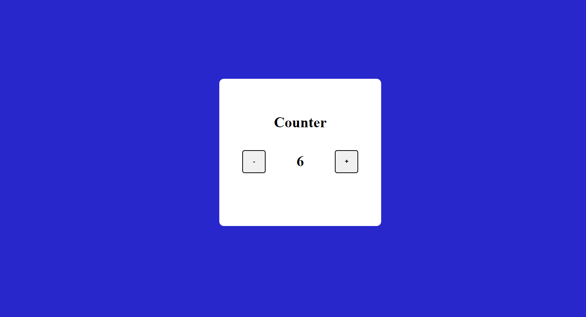

# JavaScript Project - Basic Counter App

## **Project: Basic Counter App**

### Concepts learned from this project:
- A Basic Counter app with increasing and decreasing count value.

**Live Link :** [Deployed Link](https://js-project-basiccounter.netlify.app/)
>### Preview :

